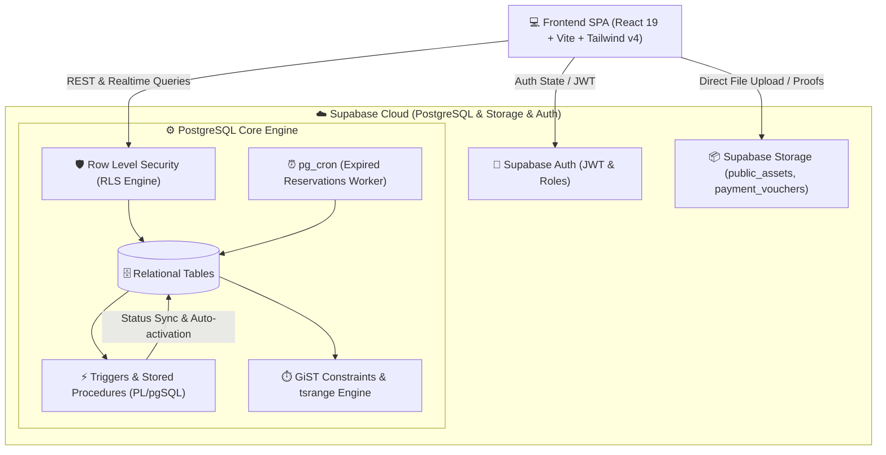
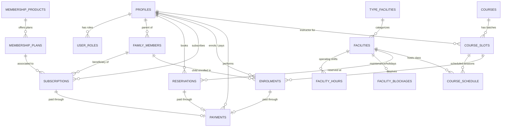
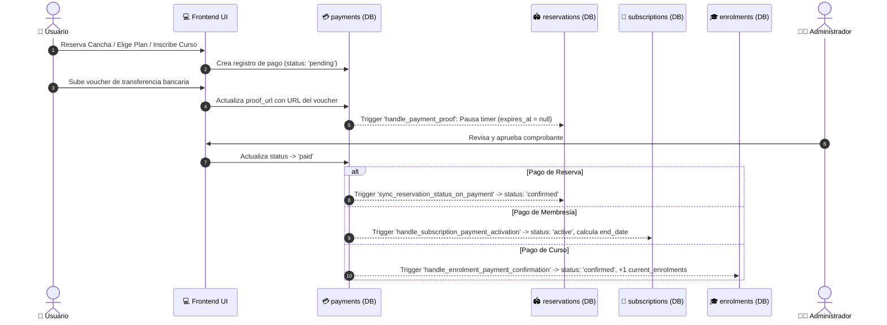

# 🏟️ ReservacionesSys — Sistema Integral de Gestión de Instalaciones, Membresías y Cursos

[](https://react.dev/)
[](https://vitejs.dev/)
[](https://supabase.com/)
[](https://www.postgresql.org/)
[](https://tailwindcss.com/)
[](https://tanstack.com/query)

**ReservacionesSys** es una plataforma web integral de alto rendimiento diseñada para la gestión integral de complejos deportivos, clubes recreativos y academias. La arquitectura combina un frontend reactivo y modular en **React 19 + Vite** con una base de datos **PostgreSQL en Supabase**, aprovechando al máximo funciones avanzadas de base de datos como tipos nativos de rango de tiempo (`tsrange`), restricciones de exclusión GiST (`EXCLUDE USING gist`), funciones RPC de alta concurrencia, triggers automáticos y políticas de seguridad a nivel de fila (**Row Level Security - RLS**).

---

## 📑 Tabla de Contenidos

1. [Arquitectura General del Sistema](#-arquitectura-general-del-sistema)
2. [Ecosistema Tecnológico](#-ecosistema-tecnológico)
3. [Estructura del Proyecto](#-estructura-del-proyecto)
4. [Diseño y Modelo de Base de Datos (`database.sql`)](#-diseño-y-modelo-de-base-de-datos-databasesql)
   - [Enums y Tipos de Datos](#1-enums-y-tipos-de-datos)
   - [Módulo de Usuarios y Familias](#2-módulo-de-usuarios-y-familias)
   - [Módulo de Instalaciones y Reservaciones](#3-módulo-de-instalaciones-y-reservaciones)
   - [Módulo de Membresías y Suscripciones](#4-módulo-de-membresías-y-suscripciones)
   - [Módulo de Cursos, Horarios e Inscripciones](#5-módulo-de-cursos-horarios-e-inscripciones)
   - [Módulo Unificado de Pagos y Comprobantes](#6-módulo-unificado-de-pagos-y-comprobantes)
   - [Módulo de Storage & Buckets](#7-módulo-de-storage--buckets)
5. [Lógica de Negocio y Triggers Automáticos](#-lógica-de-negocio-y-triggers-automáticos)
6. [Seguridad y Control de Acceso (RLS)](#-seguridad-y-control-de-acceso-rls)
7. [Arquitectura Frontend](#-arquitectura-frontend)
   - [Rutas y Control de Navegación](#rutas-y-control-de-navegación)
   - [Gestión de Estado y Servicios](#gestión-de-estado-y-servicios)
   - [Módulos de Usuario y Panel Administrativo](#módulos-de-usuario-y-panel-administrativo)
8. [Configuración y Despliegue](#-configuración-y-despliegue)

---

## 🏛️ Arquitectura General del Sistema

La arquitectura sigue el patrón **BaaS (Backend-as-a-Service) + Client-Side SPA con Data-Driven Security**:



---

## 💻 Ecosistema Tecnológico

### Frontend
- **Framework Core**: [React 19](https://react.dev/) + [Vite 7](https://vitejs.dev/)
- **Estilos y Componentes**: [TailwindCSS v4](https://tailwindcss.com/), [Radix UI Primitives](https://www.radix-ui.com/), [Lucide React](https://lucide.dev/), [Iconify](https://iconify.design/)
- **Gestión de Servidor y Caché**: [TanStack Query v5 (React Query)](https://tanstack.com/query)
- **Estado Global Cliente**: [Zustand](https://zustand-demo.pmnd.rs/)
- **Formularios y Validaciones**: [React Hook Form](https://react-hook-form.com/)
- **Enrutamiento y Layouts**: [React Router DOM v7](https://reactrouter.com/)
- **Manejo de Fechas**: [date-fns](https://date-fns.org/)
- **Feedback UI**: [Sonner (Toasts)](https://sonner.emilkowal.ski/)

### Backend & Persistencia
- **Motor de Base de Datos**: PostgreSQL 15+ administrado en Supabase
- **Seguridad**: Supabase Row Level Security (RLS) + Database Functions con `SECURITY DEFINER` y `SECURITY INVOKER`
- **Índices y Concurrencia**: Extensiones `btree_gist` y tipos de rango `tsrange` para control matemático de superposición horaria
- **Almacenamiento de Archivos**: Supabase Storage Buckets (`public_assets`, `payment_vouchers`) con políticas de Rate Limiting y UID Isolation
- **Automatización**: `pg_cron` para limpieza y cancelación de reservas pendientes vencidas

---

## 📂 Estructura del Proyecto

```
reservaciones-sys/
├── database.sql                 # Definición completa del esquema, tablas, RLS, triggers y funciones
├── package.json                 # Dependencias y scripts del proyecto
├── vite.config.js               # Configuración de Vite y plugins
├── src/
│   ├── assets/                  # Recursos estáticos locales
│   ├── components/              # Componentes organizados por dominio
│   │   ├── admin/               # Módulos del panel de administración
│   │   │   ├── courses/         # Gestión de cursos y cupos
│   │   │   ├── facilities/      # Gestión de canchas, horarios y bloqueos
│   │   │   ├── memberships/     # Gestión de planes y productos
│   │   │   ├── payments/        # Validación y revisión de comprobantes
│   │   │   ├── reservations/    # Monitoreo de reservas globales
│   │   │   ├── subscriptions/   # Gestión de altas y bajas de suscripciones
│   │   │   └── users/           # Asignación de roles y perfiles
│   │   ├── auth/                # LoginForm, SignupForm, ProtectedRoute
│   │   ├── global/              # Navbar, Footer, Modales globales, Loaders
│   │   ├── public/              # Hero, Services, MembershipsSection, HowItWorks
│   │   ├── sidebar/             # AppLayout, Sidebar, navegación responsiva
│   │   ├── ui/                  # Componentes base Shadcn/Radix UI (Button, Dialog, etc.)
│   │   └── user/                # Componentes para el usuario final (Reservas, Enrolments, etc.)
│   ├── context/                 # Contextos de Auth (`AuthContext.jsx`) y Tema (`ThemeContext.jsx`)
│   ├── hooks/                   # Custom Hooks con React Query y lógica encapsulada
│   │   ├── admin/               # Hooks especializados para queries y mutaciones admin
│   │   ├── public/              # Hooks para landing y vistas públicas
│   │   ├── useAuth.js           # Acceso rápido a sesión, rol y estado de usuario
│   │   ├── useReservations.js   # Gestión de slots, disponibilidad y reservas
│   │   ├── useMembership.js     # Gestión de membresías y suscripción activa
│   │   ├── useCourses.js        # Consulta y catálogo de cursos/talleres
│   │   ├── useEnrolments.js     # Inscripción de adultos y dependientes
│   │   └── useFamilyMembers.js  # CRUD de familiares/hijos
│   ├── lib/                     # Inicialización de Supabase (`supabase.js`) y utilidades
│   ├── pages/                   # Vistas principales del sistema
│   │   ├── Index.jsx            # Landing page pública y catálogo general
│   │   ├── admin/               # Vistas administrativas
│   │   │   ├── AdminDashboard.jsx
│   │   │   ├── AdminFacilities.jsx
│   │   │   ├── AdminEnrolments.jsx
│   │   │   ├── PaymentsManagement.jsx
│   │   │   ├── ReservationsManagement.jsx
│   │   │   ├── SubscriptionsManagement.jsx
│   │   │   ├── UsersManagement.jsx
│   │   │   └── coursesAdmin/    # Subvistas de cursos y slots
│   │   └── user/                # Vistas para miembros y clientes
│   │       ├── UserDashboard.jsx
│   │       ├── MyReservations.jsx
│   │       ├── MembershipsPage.jsx
│   │       ├── CoursesCatalog.jsx
│   │       ├── MyEnrolments.jsx
│   │       ├── FamilyMembers.jsx
│   │       └── MyProfile.jsx
│   ├── routes/                  # Configuración de rutas (`routes.jsx`, `protected.route.jsx`)
│   ├── services/                # Capa de consumo API / Supabase Client
│   │   ├── admin/               # Servicios de gestión administrativa
│   │   └── public/              # Servicios públicos y de usuario final
│   └── stores/                  # Stores ligeros de Zustand (Edge functions, Buckets)
```

---

## 🗄️ Diseño y Modelo de Base de Datos (`database.sql`)

El esquema de base de datos está normalizado y protegido bajo el principio de menor privilegio con RLS estricto.



---

### 1. Enums y Tipos de Datos
- `public.app_role`: `('admin', 'instructor', 'member', 'staff')`
- `public.payment_status`: `('pending', 'paid', 'failed', 'refunded')`
- `public.subscription_status`: `('pending', 'active', 'inactive', 'past_due', 'cancelled')`

---

### 2. Módulo de Usuarios y Familias

#### `public.profiles`
Extensión de `auth.users` que almacena metadatos del usuario:
- **Campos**: `id (FK auth.users)`, `first_name`, `last_name`, `email`, `phone`, `address`, `city`, `date_birth`, `profile_image_url`, `stripe_customer_id`, `created_at`, `updated_at`.
- **Triggers**: `on_auth_user_created` ejecuta `public.handle_new_user()` tras el registro para insertar el perfil automáticamente.

#### `public.user_roles`
Mapeo de roles de usuario con soporte multi-rol:
- **Campos**: `id`, `user_id (FK auth.users)`, `role (app_role)`, `created_at`.
- **Seguridad**: Función `public.has_role(_user_id, _role)` de tipo `SECURITY DEFINER` para evaluación segura en políticas RLS.
- **Trigger**: `on_profile_created` asigna por defecto el rol `'member'` a todo nuevo perfil.

#### `public.family_members`
Permite a un usuario titular registrar hijos o dependientes para inscripciones a cursos infantiles y membresías familiares:
- **Campos**: `id`, `parent_id (FK profiles)`, `first_name`, `last_name`, `date_of_birth`, `gender`, `medical_notes`, timestamps.

---

### 3. Módulo de Instalaciones y Reservaciones

#### `public.type_facilities`
Categorización de espacios deportivos (e.g., Tenis, Natación, Pádel, Gimnasio, Fútbol).

#### `public.facilities`
Espacio físico reservable:
- **Campos**: `id`, `name`, `description`, `image_urls (jsonb)`, `is_active`, `type_id (FK type_facilities)`, `capacity`, `price_per_hour`, timestamps.

#### `public.facility_hours`
Horarios de apertura y turnos operativos por día de la semana (`0 = Domingo` a `6 = Sábado`):
- **Restricción de No Solapamiento de Turnos**:
  ```sql
  CONSTRAINT no_overlapping_shifts EXCLUDE USING gist (
    facility_id WITH =,
    day_of_week WITH =,
    tsrange(('2000-01-01'::date + open_time), ('2000-01-01'::date + close_time)) WITH &&
  )
  ```

#### `public.facility_blockages`
Bloqueos extraordinarios de instalaciones (e.g., Feriados, mantenimientos de emergencia, eventos privados) con tipo `tsrange` y restricción `EXCLUDE USING gist`.

#### `public.reservations`
Registros de reserva horaria:
- **Campos**: `id`, `user_id`, `facility_id`, `booked_period (tsrange)`, `status ('pending', 'confirmed', 'cancelled')`, `total_price`, `expires_at`, timestamps.
- **Garantía Anti-Colisión (Exclusión GiST)**:
  ```sql
  EXCLUDE USING gist (
    facility_id WITH =,
    booked_period WITH &&
  ) WHERE (status != 'cancelled')
  ```
- **Control de Expiración**: Al crearse una reserva `pending`, el trigger `set_reservation_timer` establece `expires_at = now() + 30 minutes`.
- **RPC `get_available_slots`**: Procedimiento almacenado que calcula los turnos libres del día ignorando horas pasadas, considerando mantenimientos (`facility_blockages`) y reservas activas.

---

### 4. Módulo de Membresías y Suscripciones

#### `public.membership_products`
Catálogo de productos/membresías (e.g., "Plan Gold", "Plan Platinum Familiar") con array de características `features (jsonb)` e imagen.

#### `public.membership_plans`
Planes de precios y duraciones para cada producto:
- **Campos**: `id`, `product_id (FK membership_products)`, `name`, `price`, `currency`, `duration (interval)` (e.g., `'1 month'`, `'1 year'`), `is_active`.

#### `public.subscriptions`
Suscripción real vinculada al usuario o a un familiar dependiente:
- **Campos**: `id`, `user_id`, `plan_id`, `family_member_id (opcional)`, `status (subscription_status)`, `start_date`, `end_date`, `auto_renew`, `cancellation_reason`, `cancelled_at`.
- **Protección de Datos**: Triggers `trigger_sanitize_insert_subscription` y `trigger_restrict_update_subscription` evitan que usuarios no administradores manipulen fechas o estados directamente.

---

### 5. Módulo de Cursos, Horarios e Inscripciones

#### `public.courses`
Definición de disciplinas y academias (e.g., Natación Niños, Tenis Adultos).

#### `public.course_slots`
Instancias o ciclos específicos de un curso:
- **Campos**: `id`, `course_id`, `instructor_id (FK profiles)`, `facility_id (FK facilities)`, `max_capacity`, `current_enrolments`, `price`, `start_date`, `end_date`, `duration`, `is_active`.
- **Flexibilidad de Modalidad**: Validación mediante constraint `check_course_timing_type` para soportar tanto ciclos de fechas fijas (`start_date` & `end_date`) como ciclos por periodo (`duration`).

#### `public.course_schedule`
Días y horarios semanales en que se dicta cada slot:
- **Validación Anti-Colisión de Instructores e Instalaciones**:
  ```sql
  -- Evita que un instructor tenga 2 clases simultáneas
  CONSTRAINT no_instructor_clash EXCLUDE USING gist (
    instructor_id WITH =, day_of_week WITH =,
    tsrange(('2000-01-01'::date + start_time), ('2000-01-01'::date + end_time)) WITH &&
  );
  
  -- Evita que una instalación se ocupe por 2 cursos a la vez
  CONSTRAINT no_facility_course_clash EXCLUDE USING gist (
    facility_id WITH =, day_of_week WITH =,
    tsrange(('2000-01-01'::date + start_time), ('2000-01-01'::date + end_time)) WITH &&
  );
  ```

#### `public.enrolments`
Inscripción del usuario titular o de un dependiente (`child_id`):
- **Restricción Exclusiva**: Constraint `enrolment_target_check` asegura que pertenezca a `profile_id` o `child_id` (XOR lógico).
- **Índices Parciales Únicos**: Impide duplicidad de inscripciones en estado `pending` o `confirmed` para el mismo slot.

---

### 6. Módulo Unificado de Pagos y Comprobantes

#### `public.payments`
Tabla polimórfica central que concentra los cobros del sistema:
- **Campos**: `id`, `user_id`, `amount`, `currency`, `status (payment_status)`, `payment_method`, `proof_url`, `subscription_id`, `plan_id`, `reservation_id`, `enrolment_id`.
- **Columna Generada Determinística (`payment_type`)**:
  ```sql
  COLUMN payment_type text GENERATED ALWAYS AS (
    CASE
      WHEN reservation_id IS NOT NULL THEN 'reservation'
      WHEN subscription_id IS NOT NULL AND plan_id IS NOT NULL THEN 'subscription'
      WHEN enrolment_id IS NOT NULL THEN 'enrolment'
      ELSE 'unknown'
    END
  ) STORED
  ```
- **Constraint de Exclusividad**: `check_single_payment_target` garantiza a nivel de esquema que un registro de pago apunte a **exactamente un** destino (o reserva, o suscripción, o curso).

---

### 7. Módulo de Storage & Buckets

1. **`public_assets`**: Bucket público para imágenes de canchas, cursos y membresías. Lectura abierta para todos; escritura, edición y borrado restringidos exclusivamente a administradores (`has_role(auth.uid(), 'admin')`).
2. **`payment_vouchers`**: Bucket seguro para comprobantes de pago subidos por los usuarios:
   - **Aislamiento por Carpeta**: El usuario solo puede subir archivos dentro de la ruta `auth.uid()/*`.
   - **Rate Limiting**: Máximo 10 comprobantes subidos por usuario en una ventana de 1 hora.
   - **Acceso Total**: Exclusivo para administradores.

---

## ⚡ Lógica de Negocio y Triggers Automáticos

El sistema delega la integridad financiera y temporal a triggers PostgreSQL de alta confiabilidad:



### Detalle de Triggers Clave:
1. **`stop_timer_on_payment_insert / update`**: Al registrar un `proof_url`, remueve el `expires_at` de la reserva para evitar que se cancele automáticamente mientras el administrador valida el pago.
2. **`sync_reservation_status_on_payment`**: Al cambiar el pago a `'paid'`, confirma la reserva; si pasa a `'failed'`, la cancela liberando el horario.
3. **`handle_subscription_payment_activation`**: Calcula la nueva fecha de vigencia (`GREATEST(now(), current_sub.end_date) + paid_plan_duration`) soportando renovaciones anticipadas y upgrades de plan.
4. **`handle_enrolment_payment_confirmation`**: Confirma la vacante, calcula el periodo y actualiza `current_enrolments` de forma atómica.

---

## 🛡️ Seguridad y Control de Acceso (RLS)

El acceso a todos los recursos está controlado mediante políticas **PostgreSQL RLS**:

| Tabla | Operación | Público / Anónimo | Miembro Autenticado (`member`) | Administrador (`admin`) |
|---|---|---|---|---|
| `profiles` | SELECT | Solo instructores (`is_instructor_profile`) | Solo su propio perfil (`auth.uid() = id`) | Todos los perfiles |
| `profiles` | UPDATE | ❌ | Solo su propio perfil | Todos los perfiles |
| `family_members` | CRUD | ❌ | Solo sus propios hijos (`parent_id = auth.uid()`) | Acceso total |
| `user_roles` | SELECT / MOD | ❌ | Lectura de roles propios | Gestión total |
| `facilities` / `types` | SELECT / MOD | Lectura de activos | Lectura de activos | Gestión total |
| `facility_hours` / `blockages` | SELECT / MOD | Lectura pública | Lectura pública | Gestión total |
| `reservations` | SELECT | ❌ | Sus propias reservas | Todas las reservas |
| `reservations` | INSERT | ❌ | Solo a su nombre, máx 3 pendientes | Gestión total |
| `reservations` | UPDATE | ❌ | Solo cancelación (`status = 'cancelled'`) | Gestión total |
| `membership_products` / `plans` | SELECT / MOD | Lectura pública | Lectura pública | Gestión total |
| `subscriptions` | SELECT / INSERT / UPDATE | ❌ | Lectura, creación y cancelación propia | Gestión total |
| `courses` / `slots` / `schedule` | SELECT / MOD | Lectura pública | Lectura pública | Gestión total |
| `enrolments` | SELECT / INSERT / UPDATE | ❌ | Inscripción propia/hijo, cancelación | Gestión total |
| `payments` | SELECT / INSERT / UPDATE | ❌ | Propios, inserción pending, subir voucher | Gestión total |

---

## 🖥️ Arquitectura Frontend

### Rutas y Control de Navegación
El frontend está estructurado mediante `react-router-dom` v7 con rutas públicas, layout protegido y vistas especializadas:

```
/                             -> Landing page con catálogo y servicios públicos
/auth/login                   -> Formulario de inicio de sesión
/auth/register                -> Formulario de registro
├── [ProtectedRoute + AppLayout]
│   ├── /dashboard            -> Panel principal del usuario (resumen, citas próximas, accesos)
│   ├── /my-reservations      -> Calendario y listado de reservas del usuario
│   ├── /memberships          -> Catálogo de membresías y suscripción activa
│   ├── /dashboard/courses    -> Catálogo interactivo de cursos y academias
│   ├── /dashboard/enrolments -> Inscripciones activas (personales y familiares)
│   ├── /profile              -> Perfil de usuario y seguridad
│   ├── /profile/family       -> Gestión de dependientes/hijos
│   └── /admin/*              -> Módulo Administrativo:
│       ├── /admin/dashboard  -> Métricas, KPIs de ingresos, ocupación
│       ├── /admin/users      -> Control de usuarios y asignación de roles
│       ├── /admin/facilities -> Configuración de canchas, horarios y bloqueos
│       ├── /admin/memberships-> Configuración de productos y precios
│       ├── /admin/reservations -> Aprobación y visualización de reservas
│       ├── /admin/payments   -> Auditoría de comprobantes y validación de cobros
│       ├── /admin/subscriptions -> Estado de suscripciones y renovaciones
│       ├── /admin/courses    -> Cursos, slots, cupos y horarios
│       └── /admin/enrolments -> Lista de participantes inscritos
```

### Gestión de Estado y Servicios
- **Capa de Servicios (`src/services/`)**: Centraliza todas las llamadas a Supabase Database y Storage con tipado y manejo unificado de errores.
- **Custom Hooks (`src/hooks/`)**: Emplean `@tanstack/react-query` para:
  - Cacheo inteligente de horarios disponibles (`useReservations`).
  - Invalidación automática de queries tras pagos o cancelaciones.
  - Sincronización en tiempo real del estado de autenticación (`useAuth`).

---

## 🚀 Configuración y Despliegue

### 1. Prerrequisitos
- Node.js 18.0 o superior
- Proyecto activo en [Supabase](https://supabase.com)

### 2. Variables de Entorno
Crea un archivo `.env` en la raíz del proyecto:

```env
VITE_SUPABASE_URL=https://tu-proyecto.supabase.co
VITE_SUPABASE_ANON_KEY=tu-anon-key-de-supabase
```

### 3. Configuración de Base de Datos en Supabase
1. Ingresa al **SQL Editor** de tu panel de Supabase.
2. Copia y ejecuta el contenido completo del archivo [`database.sql`](./database.sql).
3. Asegúrate de que los buckets `public_assets` y `payment_vouchers` se hayan creado con sus respectivas políticas de Storage.

### 4. Instalación y Ejecución Local
```bash
# Instalar dependencias
npm install

# Iniciar servidor de desarrollo en Vite
npm run dev

# Compilar para producción
npm run build

# Previsualizar build de producción
npm run preview
```

---

## 👥 Roles del Sistema

- **Admin**: Acceso completo al panel administrativo, validación de pagos, gestión de canchas, asignación de instructores, bloqueo de fechas y altas de productos.
- **Instructor**: Visualización de sus horarios de clases asignados y listas de asistencia de alumnos.
- **Member / Cliente**: Reserva de instalaciones deportivas, compra de planes de membresía, inscripción a cursos propios o de dependientes familiares y carga de comprobantes de pago.
- **Staff**: Apoyo operativo en recepción y verificación de reservas presenciales.

---

## 📄 Licencia

Este proyecto fue desarrollado como solución profesional para la gestión deportiva y de reservaciones. Todos los derechos reservados.
